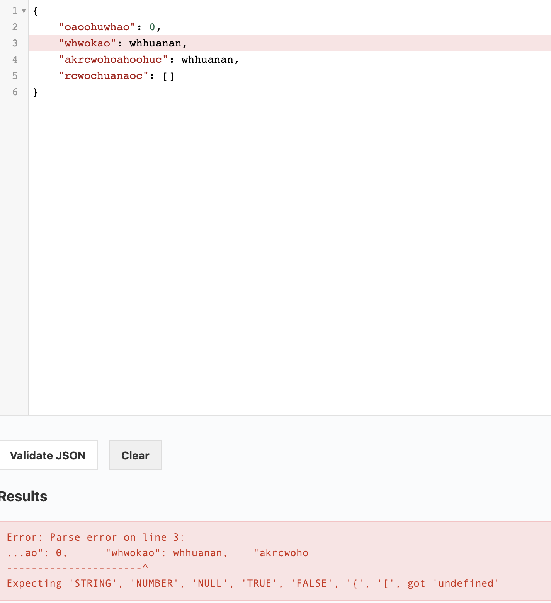

**Summary**

Invalid JSON returned for *wookiee* format if *null* values are present in response

**Description**

*Null* values are converted to strings without quotes which makes JSON, returned by `GET /api/people/` endpoint with `format=wookiee` query, as ivalid.

**Steps to reproduce**
1. Perform GET https://swapi.py4e.com/api/people/?format=wookiee&search=0
2. Check the returned response

**Actual result**

`{
	"oaoohuwhao": 0,
	"whwokao": whhuanan,
	"akrcwohoahoohuc": whhuanan,
	"rcwochuanaoc": []
}`

There are no quotes around whhuanan strings (null for a non-wookiee format) which makes the JSON to be invalid

**Expected result**

_whhuanan_ strings should either be quoted or just return null instead